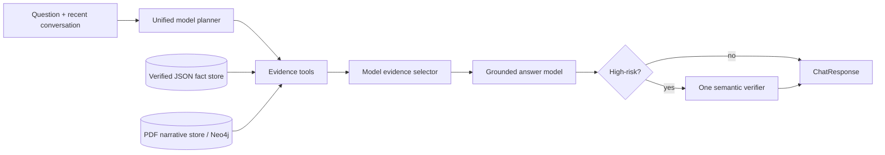

# Unified RAG pipeline

The answer path intentionally has six responsibilities and one canonical file
for each responsibility:

```text
rag/
├── contracts.py       # small data contracts
├── planner.py         # conversation + normalization + one semantic plan
├── evidence.py        # fact/narrative retrieval + model selection
├── generator.py       # grounded Markdown answer + claim/evidence bindings
├── verifier.py        # one conditional semantic verifier
├── pipeline.py        # short orchestration and public diagnostics
└── retrieval/
    └── published_content_repository.py  # reviewed JSON + Neo4j adapter
```



Language understanding, decomposition, criterion choice and synthesis belong
to the model. Code owns JSON contracts, IDs, repository access, citations,
security, caching, diagnostics and logging. There are no question-specific
validators and no field-gap retry chain.

For causal questions, the planner creates the smallest set of distinct causal
requirements needed by the question instead of one broad "causes" bucket.
Every generated claim carries both evidence IDs and requirement IDs. The same
single semantic verifier checks factual support and requirement coverage; when
selected evidence supports an omitted requirement, it can repair the answer in
that one pass. Reviewed JSON fact records are reserved space in the candidate
window so broad PDF vector matches cannot hide a direct curated fact.

Long explanatory answers end their major sections with short, evidence-derived
memory anchors. Direct lookups stay concise; comparisons and timelines use
mode-appropriate summary anchors instead of one fixed presentation template.

## Regression evaluation

Cross-topic examples live in `SourceCode/evals/history_rag_cases.json`. They
are evaluation data only and are never imported by the runtime pipeline. Run
the smoke suite against a local backend with:

```bash
./.venv/bin/python SourceCode/scripts/run_rag_eval.py
```

Adding a regression means adding an eval case or improving a general contract;
it must not add a historical answer, named event, person, place or date to the
runtime planner, selector or verifier.
